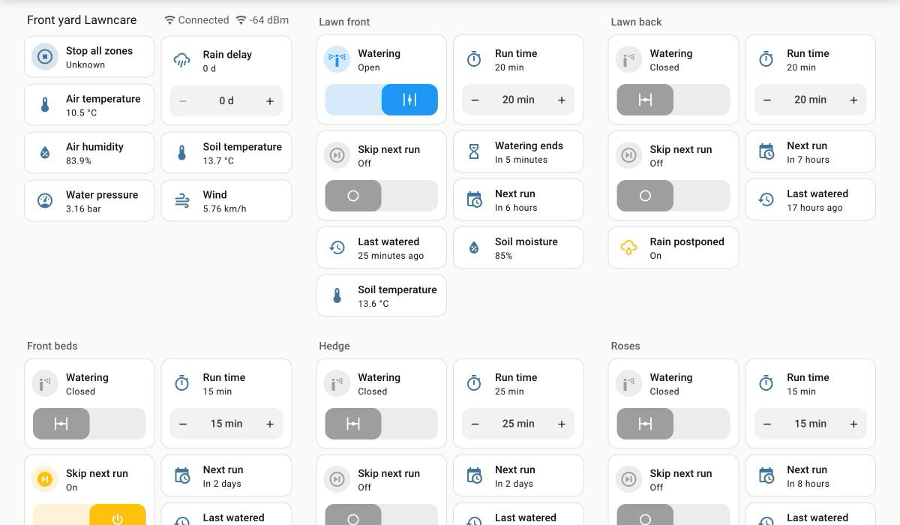
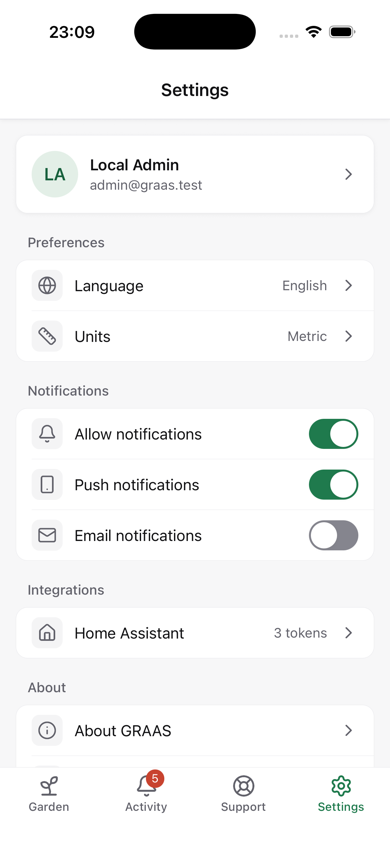
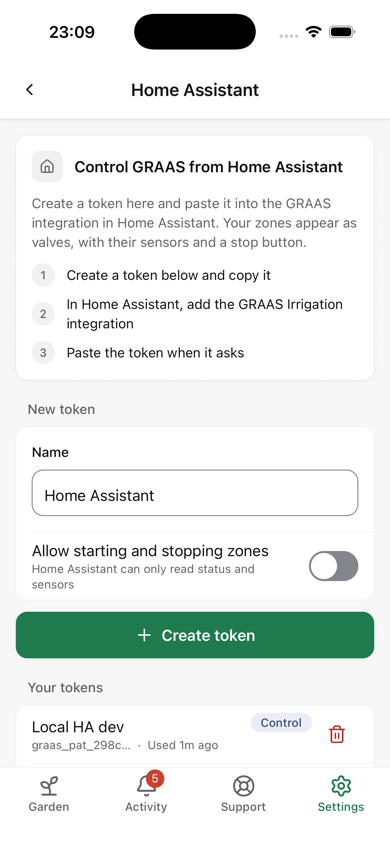
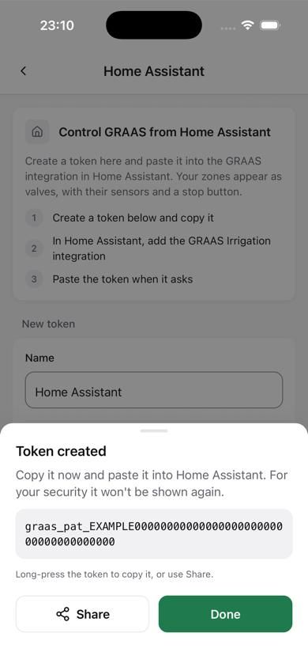
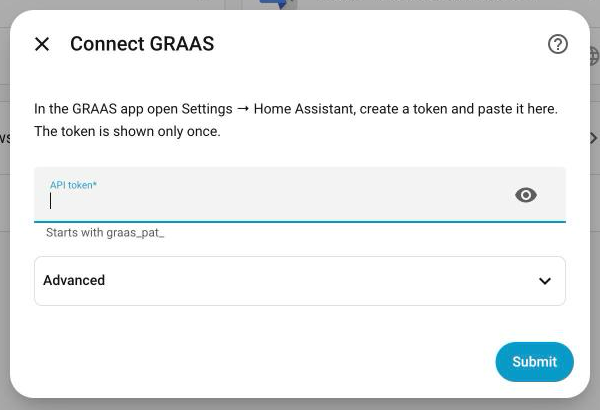
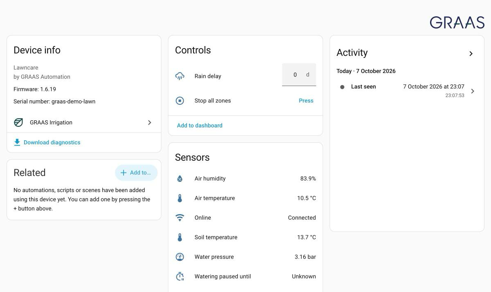
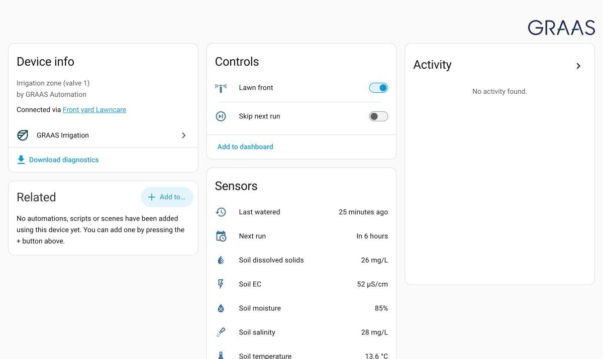

# GRAAS Irrigation for Home Assistant

[![HACS Custom][hacs-badge]][hacs]
[![GitHub Release][release-badge]][releases]
[![License: MIT][license-badge]](LICENSE)

Control your **GRAAS irrigation controllers** from [Home Assistant](https://www.home-assistant.io/).
Every zone becomes a water valve you can open, close and automate. Sensors, schedules and rain delays come along.



**Contents:** [Features](#features) · [Requirements](#requirements) · [Installation](#installation) · [Setup](#setup) · [What you get](#what-you-get) · [Actions](#actions) · [Automations](#automation-examples) · [Troubleshooting](#troubleshooting) · [Support](#support-and-contributing)

## Features

- 💧 **Zones as valves.** Open a zone to water for its run time, close it to stop. Every run ends on its own.
- ⏱️ **Run time per zone.** Set how long "open" waters (1–120 min).
- 🌧️ **Rain delay.** Pause all scheduled watering on a controller for 1–14 days.
- ⏭️ **Skip next run.** Skip one zone's next scheduled run.
- 🛑 **Stop all.** One button stops every zone on a controller.
- 🌱 **Sensors.** Soil moisture, temperature, EC, pH and nutrients where a soil sensor is fitted. Air temperature, humidity, wind and pressure where the controller reports them.
- 📅 **Schedule info.** See the next run, the last time a zone was watered, and when the current run ends.
- 📊 **Ready-made dashboard.** Generated for your controllers. It uses only built-in cards.
- 🌍 Available in English and Lithuanian.

It works through the GRAAS cloud, the same way as the GRAAS app, so every GRAAS controller is supported (Wi-Fi and GSM).

## Requirements

- Home Assistant **2025.10** or newer, with internet access.
- A GRAAS account with at least one controller, and the **GRAAS app** (to create an access token).

Your controllers keep running their own schedules even when Home Assistant is offline.

## Installation

### Option 1: HACS (recommended)

1. Install [HACS](https://hacs.xyz/docs/use/) if you don't have it yet.
2. In Home Assistant open **HACS → ⋮ (top right) → Custom repositories**.
3. Add `https://github.com/Ere5/graas-home-assistant` with type **Integration**.
4. Search HACS for **GRAAS Irrigation**, open it and click **Download**.
5. Restart Home Assistant (**Settings → System → ⏻ → Restart Home Assistant**).

HACS tells you when a new version is available.

### Option 2: Manual

1. Download the latest release from the [Releases page][releases].
2. Copy the `custom_components/graas` folder into your Home Assistant configuration folder, so that you have `config/custom_components/graas/manifest.json`.
   The **Samba share** or **File editor** add-on makes this easy.
3. Restart Home Assistant.

## Setup

Setup takes about two minutes: you create a token in the GRAAS app, then paste it into Home Assistant.

### Step 1: Create an access token in the GRAAS app

<table>
  <tr>
    <td align="center" width="33%"></td>
    <td align="center" width="33%"></td>
    <td align="center" width="33%"></td>
  </tr>
  <tr>
    <td align="center"><b>1.</b> Open <b>Settings → Home Assistant</b></td>
    <td align="center"><b>2.</b> Name the token, choose access, tap <b>Create token</b></td>
    <td align="center"><b>3.</b> Copy the token. It is shown only once</td>
  </tr>
</table>

Choose the access with **Allow starting and stopping zones**. It starts off, so a new token is read only until you turn it on:

- **On**: Home Assistant can see everything **and** start or stop watering.
- **Off**: the token is **read only**, so Home Assistant can only show status and sensors.

> [!TIP]
> To copy the token, long-press it, or tap **Share** to send it to the device where Home Assistant is open.

### Step 2: Add the integration in Home Assistant

1. Go to **Settings → Devices & services → + Add integration**.
2. Search for **GRAAS Irrigation**.
3. Paste the token and click **Submit**.

<p align="center">
  
</p>

Your controllers and zones appear as devices. Put each zone in an area ("Front yard", "Greenhouse"), and it shows up in the right room.

> [!IMPORTANT]
> Keep the token secret, like a password. If it leaks, revoke it in the app (**Settings → Home Assistant → ✕**) and create a new one.

### Step 3 (optional): Add the dashboard

See [`graas.dashboard`](#graasdashboard-create-the-dashboard) below to get the dashboard shown at the top of this page in one step.

## What you get

Each **controller** is a device, and **each zone is its own device** linked to its controller.

<table>
  <tr>
    <td align="center" width="50%"></td>
    <td align="center" width="50%"></td>
  </tr>
  <tr>
    <td align="center">Controller: status, Stop all, rain delay</td>
    <td align="center">Zone: valve, skip next run, run time, schedule</td>
  </tr>
</table>

**Controller**

| Entity | Description |
|---|---|
| Online | Whether the controller is connected |
| Stop all zones | Button that stops every zone on this controller |
| Rain delay | 0–14 days (0 = off). Scheduled runs are skipped until it ends |
| Watering paused until | When the rain delay ends |
| Weather and soil sensors | Air temperature and humidity, soil temperature, water pressure (and a second pressure sensor), wind. Only the sensors the controller reports |
| Signal strength, Last seen | Diagnostics |

**Zone**

| Entity | Description |
|---|---|
| *Zone name* (valve) | Open = water for the run time, close = stop |
| Run time | How long "open" waters, 1–120 min. Starts at the zone's schedule length (otherwise 15 min) |
| Skip next run | Skips the next scheduled run, then turns itself off. Only on zones with a schedule or program |
| Watering ends | When the current run ends |
| Next run / Last watered | As shown in the GRAAS app |
| Soil sensors | Moisture, temperature, EC, pH, nitrogen, phosphorus, potassium, salinity, TDS. Only where a soil sensor is fitted |
| Rain postponed | Whether rain has postponed this zone (zones with rain postponement on) |
| Flow rate | Off by default; enable it if the controller has a flow meter |

Rain delay and skip next run hold **scheduled** runs only: opening a valve still waters.
If a controller is offline, GRAAS keeps the change and sends it when the controller reconnects.

## Actions

### `graas.start_zone`: water for a time or an amount

```yaml
action: graas.start_zone
target:
  entity_id: valve.front_yard_lawn
data:
  duration_minutes: 10   # 1–120
  # or
  # liters: 40           # 0.1–2000, needs a flow meter
```

You can target valves, zone devices, areas or labels. Every GRAAS valve in the target starts.

### `graas.stop_all`: stop every zone

```yaml
action: graas.stop_all
target:
  area_id: front_yard   # optional: a controller, zone, area or label
```

Every zone on the targeted controllers stops. A zone in the target counts as its controller. Without a target, all your GRAAS controllers stop.

### `graas.dashboard`: create the dashboard

Generates the dashboard shown at the top of this page.

1. Go to **Developer tools → Actions**, choose **GRAAS Irrigation: Dashboard** and click **Perform action**.
2. Copy the YAML from the response.
3. Go to **Settings → Dashboards → + Add dashboard → New dashboard from scratch** and open it.
4. Click **✏️ Edit → ⋮ → Raw configuration editor**, paste the YAML and save.

Run the action again after adding controllers or zones.

## Automation examples

**Water the lawn for 15 minutes at sunrise if it didn't rain:**

```yaml
automation:
  - alias: "Lawn at sunrise"
    triggers:
      - trigger: sun
        event: sunrise
    conditions:
      - condition: state
        entity_id: weather.home
        state: "sunny"
    actions:
      - action: graas.start_zone
        target:
          entity_id: valve.front_yard_lawn
        data:
          duration_minutes: 15
```

**Pause watering for 2 days when heavy rain is forecast:**

```yaml
automation:
  - alias: "Rain delay on heavy rain"
    triggers:
      - trigger: numeric_state
        entity_id: sensor.rain_forecast_today
        above: 10
    actions:
      - action: number.set_value
        target:
          entity_id: number.garden_rain_delay
        data:
          value: 2
```

## Safety

- Every run started from Home Assistant has an end (a time or an amount). Open-ended watering is not possible.
- Starts go through the same checks as the GRAAS app: the controller must be online, and only one zone waters at a time. If you start a zone while another runs, the controller queues it.
- On Irigator controllers a litres amount is per plant. The total (litres × plants) can't exceed 2000 L.
- Runs started from Home Assistant show in GRAAS history as **Home Assistant**.
- Commands are limited to 30 per minute per token, so a broken automation can't flood your valves.
- Revoke the token in the GRAAS app at any time, and Home Assistant loses access immediately.

## Privacy

The integration talks only to the GRAAS cloud (`https://ss.graasautomation.com`), using the token you created.
The token is stored in Home Assistant's configuration and is hidden in diagnostics downloads.
Nothing is sent anywhere else.

## Troubleshooting

| Problem | What to do |
|---|---|
| "Invalid token" when adding | Copy the whole token again. It starts with `graas_pat_`. Create a new one if you lost it |
| "Re-authentication required" | The token was revoked, or you changed or reset your GRAAS password (that signs out every device and token). Create a new token in the app and enter it |
| "Too many requests" | More than 30 commands a minute were sent. Check your automations for loops. It recovers on its own after a minute |
| Valves show **Unavailable** | The controller is offline. Check its power and connection in the GRAAS app |
| Can't open valves, but sensors work | The token is read-only. Create a token with **Control** |
| A new controller or zone is missing | Reload the integration: **Settings → Devices & services → GRAAS Irrigation → ⋮ → Reload** |
| Something else | Download diagnostics (**⋮ → Download diagnostics**) and attach it to an [issue][issues] |

State is refreshed every 30 seconds, and straight after each command.

## Removing the integration

1. **Settings → Devices & services → GRAAS Irrigation → ⋮ → Delete**.
2. Revoke the token in the GRAAS app (**Settings → Home Assistant**).
3. If you installed with HACS, remove it there as well.

## Support and contributing

- Bugs and ideas: [open an issue][issues].
- Developer documentation: [docs/DEVELOPMENT.md](docs/DEVELOPMENT.md).

This is a community-installable custom integration and is not part of Home Assistant itself.

[hacs]: https://hacs.xyz
[hacs-badge]: https://img.shields.io/badge/HACS-Custom-41BDF5.svg
[releases]: https://github.com/Ere5/graas-home-assistant/releases
[release-badge]: https://img.shields.io/github/v/release/Ere5/graas-home-assistant
[license-badge]: https://img.shields.io/badge/License-MIT-yellow.svg
[issues]: https://github.com/Ere5/graas-home-assistant/issues
